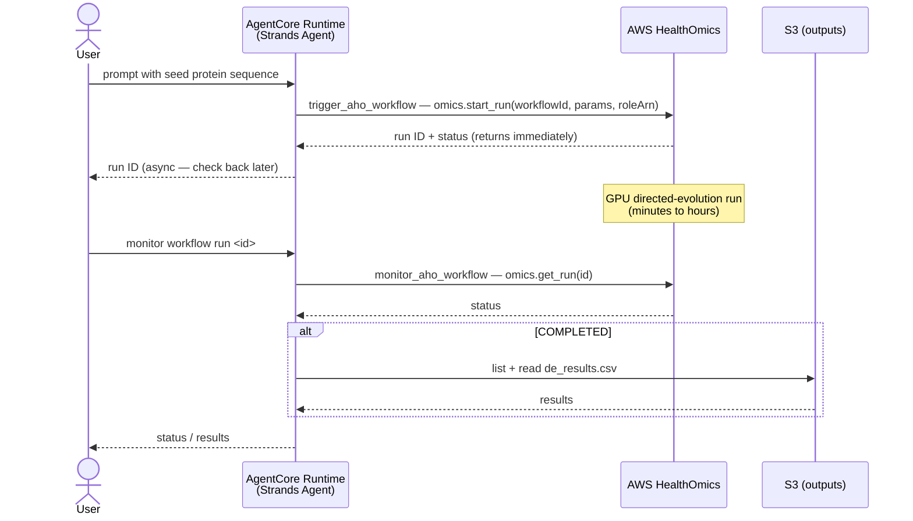

# Protein Design Agent — AgentCore

Runs protein design optimization on AWS HealthOmics. The agent triggers a
pre-existing HealthOmics Nextflow workflow (EvoProtGrad / ESM-2 directed
evolution on GPU) for a seed protein sequence and monitors the asynchronous
run's status and results. Based on [agentcore_template](../../../agentcore_template).

Migrated from the notebook-driven Bedrock Agent + two Lambda action groups in the
[parent directory](../). The tools here are thin wrappers over the same boto3
`omics` / `s3` calls the Lambdas made; the heavy compute stays in HealthOmics.

## Architecture



## Tools

| Tool | Wraps | Purpose |
|------|-------|---------|
| `trigger_aho_workflow(seed_sequence, ...)` | `omics.start_run` | Starts a HealthOmics directed-evolution run; returns the run ID immediately (asynchronous). |
| `monitor_aho_workflow(run_id)` | `omics.get_run` (+ `s3` on completion) | Reports run status; for a completed run, summarizes output files including `de_results.csv`. |

## Pre-existing infrastructure

This agent orchestrates infrastructure it does **not** create. The following must
already exist (provisioned by the parent [`protein_design_stack.yaml`](../protein_design_stack.yaml)):

- **HealthOmics workflow** — the directed-evolution Nextflow workflow (`WorkflowId` stack output).
- **ECR image** — the GPU EvoProtGrad / ESM-2 container image, passed to the workflow as `container_image`.
- **ESM-2 model weights** — in S3 (e.g. `s3://<bucket>/models/esm2_t33_650M_UR50D/`).
- **Workflow execution role** — the omics-assumable role passed as `roleArn` to `start_run`.
- **S3 bucket** — for run outputs.

## Configuration

| Env var | Description |
|---------|-------------|
| `MODEL_ID` | Bedrock model (default `global.anthropic.claude-sonnet-5`, a global inference profile). |
| `WORKFLOW_ID` | HealthOmics workflow ID (stack output `WorkflowId`). Required to trigger. |
| `ROLE_ARN` | Workflow execution role ARN passed to `start_run`. Required to trigger. |
| `ECR_URI` | Container image URI passed to the workflow. Required to trigger. |
| `S3_BUCKET` | Bucket for default output URIs. |
| `ESM_MODEL_FILES` | S3 path to ESM-2 weights (default workflow parameter). |
| `DEFAULT_OUTPUT_TYPE` / `DEFAULT_PARALLEL_CHAINS` / `DEFAULT_N_STEPS` / `DEFAULT_MAX_MUTATIONS` | Optimization defaults (`all` / `10` / `100` / `15`). |

The AgentCore runtime execution role needs `omics:StartRun`, `omics:GetRun`,
`iam:PassRole` (to the workflow execution role), and `s3:ListBucket` /
`s3:GetObject` on the output bucket — the same permissions the two Lambda roles
hold today.

## Deploy

```bash
pip install bedrock-agentcore-starter-toolkit   # if not already installed

# 1. Configure the runtime (auto-creates execution role + sources bucket)
agentcore configure -e main.py -n protein_design_agent \
  -rf requirements.txt --disable-otel --disable-memory

# 2. Deploy, passing the pre-existing infra IDs as runtime env vars
agentcore deploy \
  -env WORKFLOW_ID="$WORKFLOW_ID" \
  -env ROLE_ARN="$ROLE_ARN" \
  -env ECR_URI="$ECR_URI" \
  -env S3_BUCKET="$S3_BUCKET" \
  -env ESM_MODEL_FILES="s3://$S3_BUCKET/models/esm2_t33_650M_UR50D/"

# 3. Attach omics:StartRun/GetRun, iam:PassRole (to ROLE_ARN), and S3 read to the
#    auto-created execution role (see .bedrock_agentcore.yaml -> execution_role).

# 4. Invoke
agentcore invoke '{"prompt": "Optimize this protein sequence: MKT... using the directed evolution workflow"}'
agentcore invoke '{"prompt": "monitor workflow run <RUN_ID>"}'
```

> The `WORKFLOW_ID`, `ROLE_ARN`, `ECR_URI`, and `S3_BUCKET` values come from the
> parent CloudFormation stack outputs. If that stack has not been deployed, the
> workflow does not exist yet and `trigger_aho_workflow` will fail — deploy the
> infrastructure first.

## Test

```bash
pytest tests/ -v   # unit tests mock the omics/s3 clients — no AWS required
```
