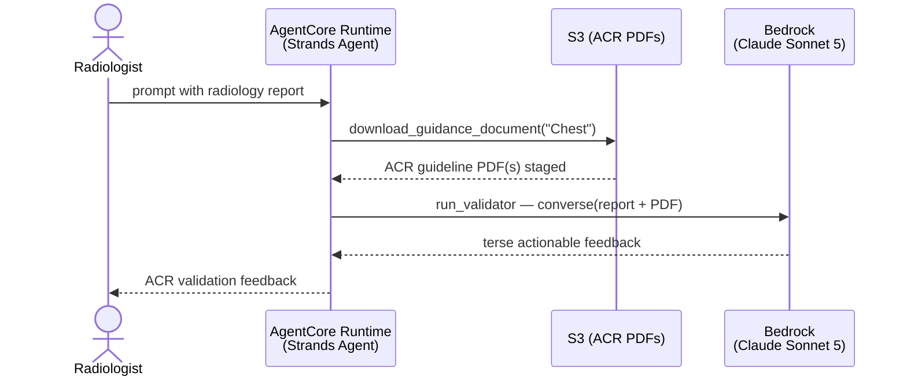

# Radiology Report Validator Agent — AgentCore

Validates radiology reports against American College of Radiology (ACR) guidance
documents. The agent stages the relevant ACR guideline PDF from S3 and grounds an
Amazon Bedrock `converse` call on it to produce terse, actionable feedback on a
report's adherence to ACR standards. Based on [agentcore_template](../../../agentcore_template).

Migrated from the notebook-driven Bedrock Agent + Lambda action group in the
[parent directory](../). The original Lambda carried unused SageMaker and AWS Batch
clients plus `BATCH_JOB_*` environment variables; that dead wiring was dropped in
this migration.

## Architecture



## Tools

| Tool | Purpose |
|------|---------|
| `download_guidance_document(anatomical_structure)` | Downloads the ACR guidance PDF(s) matching a modality/anatomical structure (e.g. `Chest`) from the S3 bucket into the local guidance directory. |
| `run_validator(report)` | Grounds a Bedrock `converse` call on the staged ACR guideline PDF and returns actionable validation feedback. |

## Prerequisites

The agent reads ACR guideline PDFs from an S3 bucket. Upload the PDFs from the
parent [`ACRdocs/`](../ACRdocs/) directory (e.g. `ACR_Chest.pdf`, `NormalChest.pdf`)
to the bucket, keying each object so the anatomical structure appears in the key
(e.g. `Chest/ACR_Chest.pdf`). The agent matches on the title-cased structure name.

## Configuration

| Env var | Default | Description |
|---------|---------|-------------|
| `MODEL_ID` | `global.anthropic.claude-sonnet-5` | Bedrock model (global inference profile) used for validation. |
| `BUCKET_NAME` | `radiologyreport-validator` | S3 bucket holding ACR guideline PDFs. |
| `GUIDANCE_DIR` | `<tmpdir>/acr_guidance` | Local directory where guideline PDFs are staged. |

The execution role needs `bedrock:InvokeModel` on the model and `s3:ListBucket` /
`s3:GetObject` on the guidance bucket.

## Deploy

Deployed and verified end-to-end on the AgentCore runtime (us-east-1) using the
`bedrock-agentcore-starter-toolkit` `agentcore` CLI.

### 1. Set up the guidance S3 bucket (one-time)

```bash
export AWS_REGION=us-east-1
BUCKET=radiologyreport-validator-$(aws sts get-caller-identity --query Account --output text)-use1

aws s3api create-bucket --bucket "$BUCKET" --region "$AWS_REGION"
aws s3api put-public-access-block --bucket "$BUCKET" \
  --public-access-block-configuration \
  BlockPublicAcls=true,IgnorePublicAcls=true,BlockPublicPolicy=true,RestrictPublicBuckets=true
aws s3api put-bucket-encryption --bucket "$BUCKET" \
  --server-side-encryption-configuration \
  '{"Rules":[{"ApplyServerSideEncryptionByDefault":{"SSEAlgorithm":"AES256"}}]}'

# Upload the ACR guideline PDFs, keyed so the anatomical structure is in the key
aws s3 cp ../ACRdocs/Chest/ACR_Chest.pdf   "s3://$BUCKET/Chest/ACR_Chest.pdf"
aws s3 cp ../ACRdocs/Chest/NormalChest.pdf "s3://$BUCKET/Chest/NormalChest.pdf"
```

### 2. Configure and deploy the agent

```bash
pip install bedrock-agentcore-starter-toolkit   # if not already installed

# Configure the runtime (auto-creates execution role, ECR, and S3 sources bucket)
agentcore configure -e main.py -n radiology_report_validator \
  -rf requirements.txt --disable-otel --disable-memory

# Deploy, passing the guidance bucket as a runtime env var
agentcore deploy -env BUCKET_NAME="$BUCKET" -env GUIDANCE_DIR=/tmp/acr_guidance
```

### 3. Grant the execution role access to the guidance bucket

`agentcore configure` auto-creates an execution role. Find it in
`.bedrock_agentcore.yaml` (`execution_role`) and attach an inline policy granting
`s3:ListBucket` / `s3:GetObject` on the guidance bucket and `bedrock:InvokeModel`
on the model / inference profile. Example:

```json
{
  "Version": "2012-10-17",
  "Statement": [
    { "Effect": "Allow", "Action": "s3:ListBucket", "Resource": "arn:aws:s3:::<BUCKET>" },
    { "Effect": "Allow", "Action": "s3:GetObject",  "Resource": "arn:aws:s3:::<BUCKET>/*" },
    { "Effect": "Allow",
      "Action": ["bedrock:InvokeModel", "bedrock:InvokeModelWithResponseStream"],
      "Resource": [
        "arn:aws:bedrock:*::foundation-model/anthropic.claude-sonnet-5*",
        "arn:aws:bedrock:*:<ACCOUNT_ID>:inference-profile/global.anthropic.claude-sonnet-5"
      ] }
  ]
}
```

### 4. Invoke

```bash
agentcore invoke '{"prompt": "Validate this chest radiology report against ACR chest guidelines using your tools. Report: CHEST X-RAY PA and lateral. Clinical indication: cough. Findings: The lungs are clear bilaterally. Impression: No acute cardiopulmonary process."}'

# Useful follow-ups
agentcore status
agentcore destroy   # tear down the runtime when finished
```

> **Note:** `global.anthropic.claude-sonnet-5` is a global inference profile,
> required because the bare model ID is not available for on-demand
> bedrock-runtime throughput. Global profiles may route requests outside the
> source Region and do not provide single-Region data residency.

## Test

```bash
pytest tests/ -v
```
